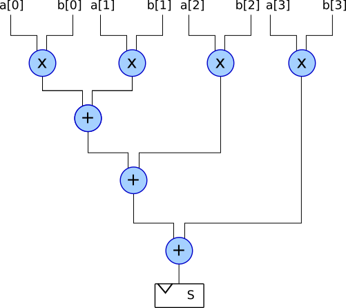
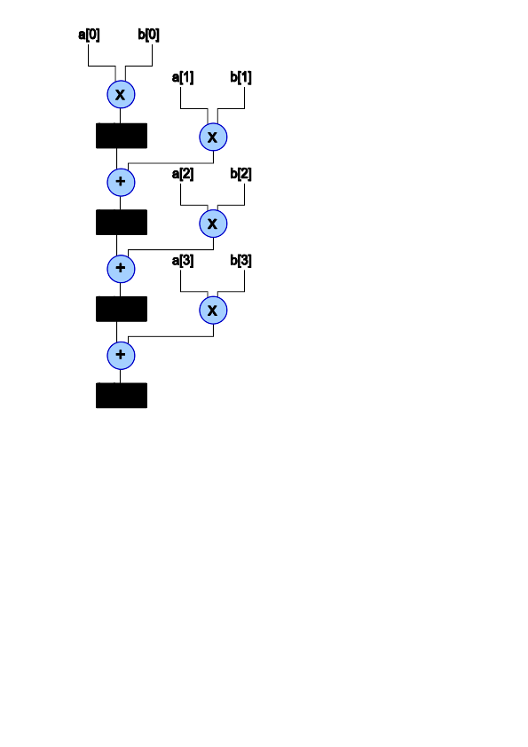
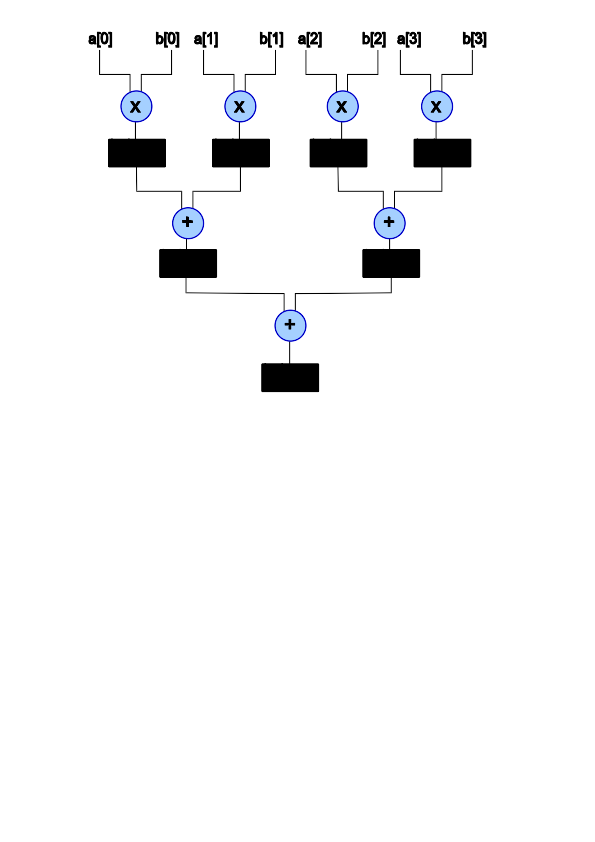

This document shows various implementations of a dot (inner) product.

I.e. the operation 

### Full-Parallel Implementation

Takes 1 clock cycle

```vhdl
s = a[0]*b[0] + a[1]*b[1] + a[2]*b[2] + a[3]*b[3]
```




### Serial Implementation

Takes 4 [N] clock cycles

```vhdl
s = a[0]*b[0]
s = s + a[1]*b[1]
s = s + a[2]*b[2]
s = s + a[3]*b[3]
```



### Pipelined Implementation

Takes 3 [ciel(log_2(N))] clock cycles

```vhdl
s1[0] = a[0]*b[0]
s1[1] = a[1]*b[1]
s1[2] = a[2]*b[2]
s1[3] = a[3]*b[3]

s2[0] = s1[0] + s1[1]
s2[1] = s1[2] + s1[3]

s = s2[0] + s2[1]
```



