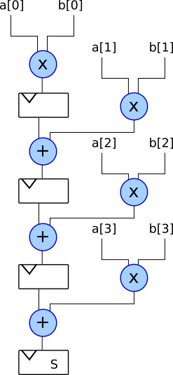
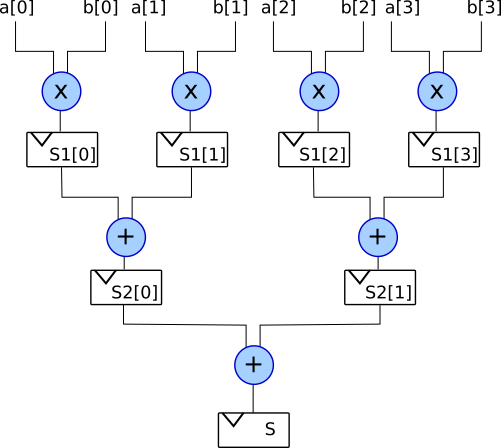

This document shows various implementations of a dot (inner) product.

I.e. the operation 

### Full-Parallel Implementation

Takes 1 clock cycle

```vhdl
s = a[0]*b[0] + a[1]*b[1] + a[2]*b[2] + a[3]*b[3]
```


### Serial Implementation

Takes 4 [N] clock cycles

```vhdl
s = a[0]*b[0]
s = s + a[1]*b[1]
s = s + a[2]*b[2]
s = s + a[3]*b[3]
```



### Pipelined Implementation

Takes 3 [ciel(log_2(N))] clock cycles

```vhdl
s1[0] = a[0]*b[0]
s1[1] = a[1]*b[1]
s1[2] = a[2]*b[2]
s1[3] = a[3]*b[3]

s2[0] = s1[0] + s1[1]
s2[1] = s1[2] + s1[3]

s = s2[0] + s2[1]
```



The code below implements the same thing, but is done with for loops.

```vhdl
for i in 0 to 3 loop
    s1[i] = a[i]*b[i]
end loop;

for i in 0 to 1 loop
    s2[i] = s1[i*2] + s1[i*2+1]
end loop;

s = s2[0] + s2[1]
```

For a length 8 array you would do:

```vhdl
for i in 0 to 7 loop
    s1[i] = a[i]*b[i]
end loop;

for i in 0 to 3 loop
    s2[i] = s1[i*2] + s1[i*2+1]
end loop;

for i in 0 to 1 loop:
    s3[i] = s2[i*2] + s2[i*2+1]

s = s3[0] + s3[1]
```

For a length N array (where N is a power of 2) you could do:

```vhdl
N = 8

for i in 0 to N-1 loop
    s_tmp[i] = a[i]*b[i]
end loop;

N_cnt = shift_right(N, 1)
while N_cnt > 0 loop
      for i in 0 to N_cnt-1 loop
      	  s_tmp[i] = s_tmp[i*2] + s_tmp[i*2+1];
	  -- s_tmp will be overwritten each clock cycle
	  -- rather than creating many shorter and shorter arrays
	  -- just re-use registers
      end loop
      N_cnt = shift_right(N_cnt, 1)
end loop

s = s_tmp[0]
```

You could pad the 2 arrays you wish to calculate the inner product of with zeros such that they have a length which is a power of 2. This takes 1+ceil(log_2(N)) clock cycles.
